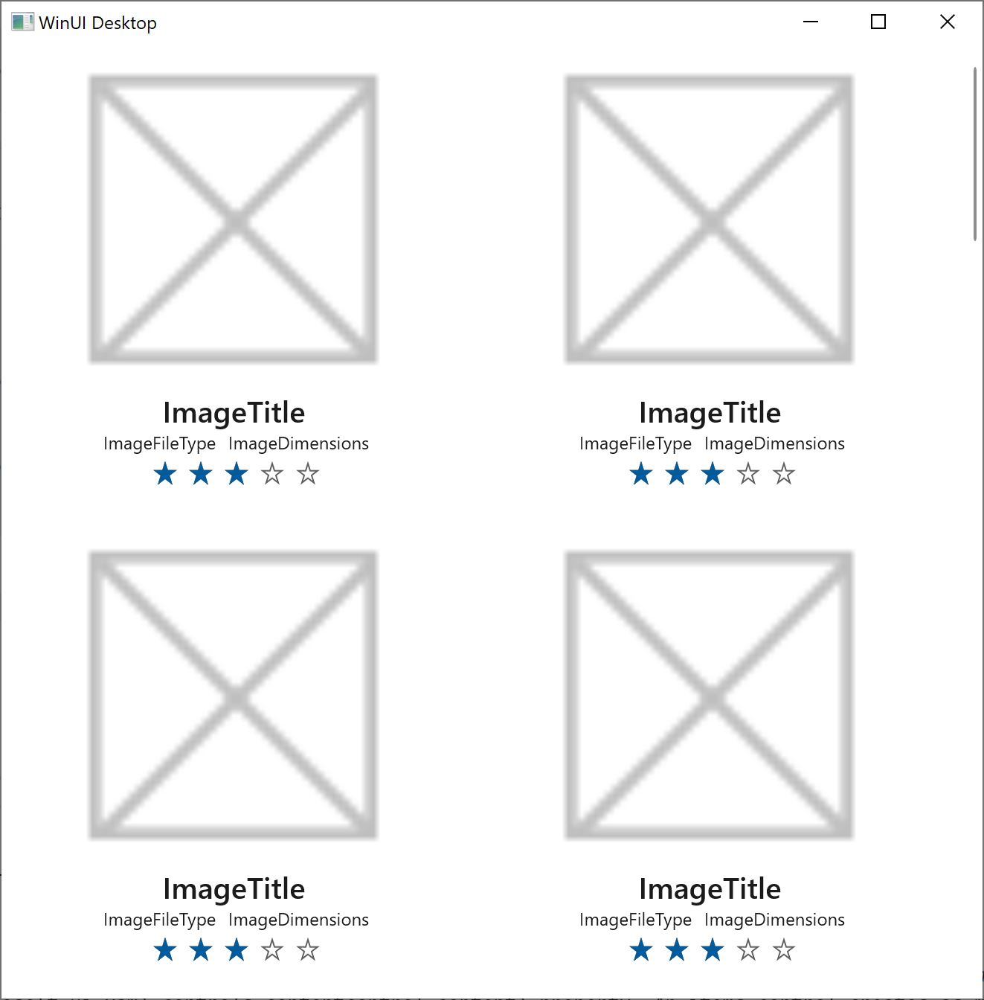

# issue
- howto
  - link
    - url: https://learn.microsoft.com/en-us/windows/apps/get-started/simple-photo-viewer-winui3?WT.mc_id=learnlive-20220524E
    - goto:https://learn.microsoft.com/en-us/windows/apps/get-started/simple-photo-viewer-winui3?WT.mc_id=learnlive-20220524E#add-a-data-template
- expected



- actual
  ```
  Exception thrown: 'System.IO.FileNotFoundException' in System.Private.CoreLib.dll
  WinRT information: An item cannot be found with the specified name (Assets\Samples).
  ```
- solution
  - link
    - url: https://github.com/microsoft/microsoft-ui-xaml/issues/6437
  - what
    - do not: copy items directly from File Explorer in any way
    - do: Add files to project folder (using the *Add* function) in the VS UI
