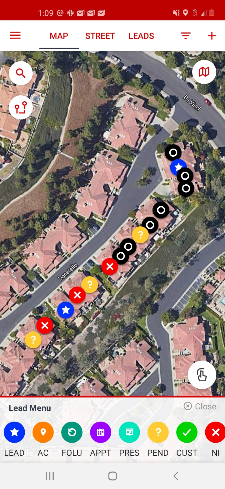

# note

- Jane (F, 40s-50s) - Has family. Roman Catholic. Knows the Protestant gospel. Asked about CBC youth group, possibly for her daughter.

- Doug (M, 40s-50s) - Non-religious. Would not talk to us. Received literature.

- Mickey (F, 40s-50s) - Spiritual, non-religious. Has a Christian friend who calls often to evangelize. Would not hear the gospel or receive literature.

- Sherry (F, 30s) - Practicing Lutheran, attends a Lutheran church in Mission Viejo. Did not have time to talk. Received literature.

- [No name given] (F, spoke over intercom) - Attends Mariners Church.

# image

