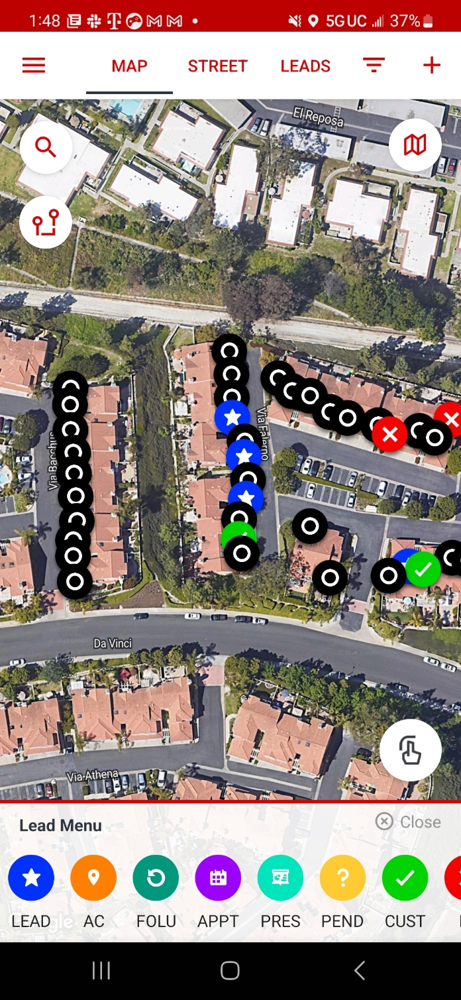

# note

- Dadiana (30s-40s, F)
  - practicing Catholic
  - attends Corpus Christi
  - has not read the Bible
  - believes in being a good person to get to heaven
  - Betsy shared the gospel with her.
    - the importance of
      - full assurance
      - Christ's sacrifice
    - She said she understood but did not seem to respond in faith.

- Mary Kell (40s-50s, F)
  - nominal Christian
  - has a copy of the Bible in French
  - received the gospel but did not seem to respond in faith

- [Declined name] (50s, M)
  - formerly Jewish
  - against organized religion
  - claims to be right with God
  - does not believe in a hell
  - lives next door to a practicing Christian who's enthusiastic about evangelizing his neighbors
  - would not receive the gospel

# image

