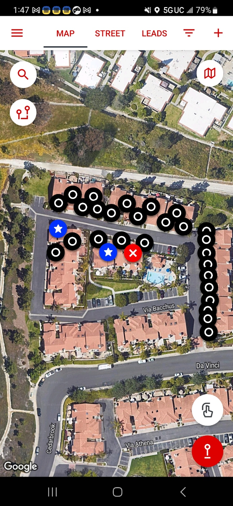

# note

- [Declined name] (30s, M)
  - would not speak to us once he heard we were doing

- Khosrow (50s–60s, M)
  - received literature
  - did not have time to talk

- Rob (30s–40s, M)
  - claims Catholic
  - knows the gospel
    - responds in a way that agrees with it whole-heartedly
      - the importance of being right with God
      - Christ is the only way
      - without his sacrifice and our trust in him, we cannot be saved
  - says he still doubts his assurance

- Brooke (20s–30s, F)
  - Catholic
  - has heard the gospel before
  - heard the gospel again and received literature
  - polite agreement, but not heart agreement
  - did not have time to talk further

# image

