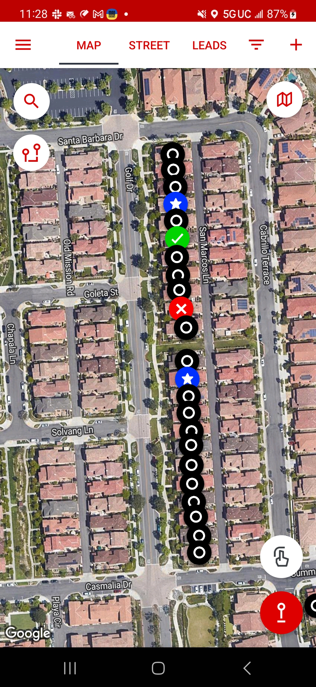

# note

- [Declined name] (40s–60s M)
  - Muslim
  - not interested in hearing us
  - took literature

- Delphi (40s–50s F)
  - Catholic
  - Spanish-speaking, from Chihuahua, Mexico
  - Ryan spoke to her and told her the gospel
    - emphasizing the need to be right with God and that works do not save us

- [Declined name] (10–12 F)
  - attends Edge ministry at Compass
  - family attends church in Anaheim

- Juli (50s F)
  - Adventist
  - appears to agree with the gospel
    - but how much is the true gospel we don't know
  - did not have time to speak further

# image

