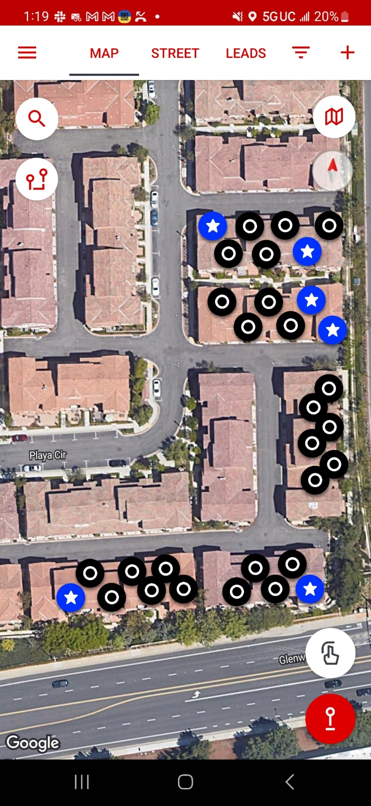

# note

- [Declined name] (30s M)
  - attends Mariners
  - took literature

- [Declined name] (30s–40s F)
  - has child
  - Hindu
  - took literature

- Aaron (20s M)
  - nominal Christian
  - heard the full gospel
  - unwilling to make a decision for Christ
  - not as concerned about salvation as he should be
  - said he would be willing to attend Compass
  - took literature

- [Declined name] (30s–40s F)
  - has family
  - Hindu
  - declined talk
  - declined literature

- Jessica (30s F)
  - has family
  - Lutheran
  - heard the full gospel from Wes
  - took literature
  - supportive of our ministry

- Eduardo (20s–30s M)
  - Catholic
  - heard the full gospel
  - says he believes
  - unwilling to make a decision for Christ
  - unwilling to repent of sin in his life
  - took literature

- [Declined name] (20s M)
  - Jewish
  - declined talk
  - declined literature

- [Declined name] (20s F)
  - Christian
  - attends Calvary Chapel
  - heard the full gospel from CJ
  - took literature

# image

